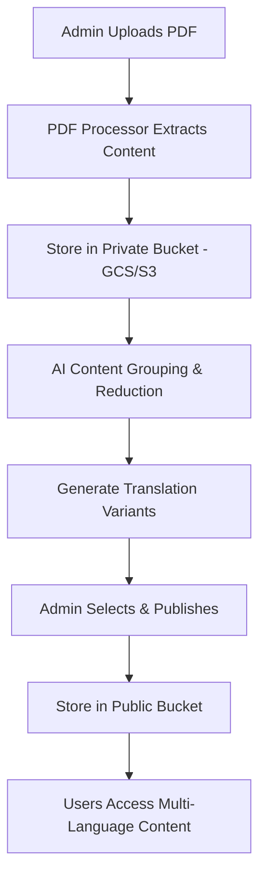

# DEHN - Multi-Language Document Processing & Publishing Platform 🚀

A comprehensive document processing system that extracts, analyzes, translates, and publishes PDF documents while preserving layout integrity across multiple languages. Built for scalable multi-language content management with AI-powered translation and layout-aware rendering.

## 🎯 Project Overview

**DEHN** is a sophisticated document processing pipeline that:

1. **📄 Extracts & Analyzes** - Converts PDFs to structured JSON with layout information, images, and text positioning
2. **🔍 Groups & Reduces** - Uses AI to detect repeated components across languages and create matchable text groups
3. **🌐 Translates & Generates** - AI-powered translation while preserving layout structure and context
4. **📝 Publishes & Displays** - Multi-language publishing with layout-aware rendering for end users

### 🏗️ Core Workflow



## 🏗️ Architecture

### Core Services
- **🐍 PDF Processor** (`services/pdf-processor/`) - Python service using PyMuPDF for layout-aware PDF extraction
- **🔐 Admin Backend** (`services/admin-backend/`) - Express TypeScript API for document processing workflow  
- **👤 User Backend** (`services/user-backend/`) - Express TypeScript API for public document access

### Frontend Applications
- **💻 Admin Panel** (`apps/admin-frontend/`) - React TypeScript interface for document processing workflow
- **📱 User App** (`apps/mobile-frontend/`) - React TypeScript interface for multi-language document viewing

### Shared Libraries
- **📋 API Models** (`packages/api-models/`) - Shared TypeScript types and interfaces
- **🤖 AI Agent** (`packages/ai-agent/`) - LLM integration for content analysis and translation

### Storage Architecture
- **🔒 Private Bucket** - Original PDFs, extracted content, processing artifacts (Admin access only)
- **🌐 Public Bucket** - Published multi-language content, optimized for public access
- **🗄️ Database** - MongoDB Atlas for metadata, processing status, and content relationships

### Infrastructure
- **☁️ Google Cloud Platform** - Production deployment with Cloud Storage buckets
- **🐳 Local Development** - MinIO for S3-compatible local storage
- **🚀 Terraform** (`infrastructure/terraform/`) - Infrastructure as code

## � Document Processing Workflow

### Phase 1: Upload & Extraction
1. **Admin uploads PDF** via admin panel
2. **PDF Processor** extracts:
   - Layout-aware text with positioning
   - Images with bounding boxes
   - Font properties and styling
   - Page structure and hierarchy
3. **Storage**: Original PDF + extracted ZIP stored in **private bucket**
4. **Database**: Create document record with processing status
5. **Admin sees**: Real-time processing status with statistics or error details

### Phase 2: Content Grouping & Reduction
1. **AI Analysis**: Detect repeated components across languages
2. **Text Grouping**: 
   - Titles → Group by semantic meaning
   - Paragraphs → Merge words into coherent groups
   - Language tagging for all text elements
3. **Markdown Generation**: Create chunked markdown with metadata
4. **Layout Preservation**: Maintain source layout relationships
5. **Storage**: Processed groups and markdown chunks in **private bucket**

### Phase 3: Translation & Generation
1. **Language Selection**: Choose source language for layout/text reference
2. **AI Translation**: Generate missing language versions using:
   - Primary source language for context
   - Other language versions as secondary context
   - Layout-aware translation preserving structure
3. **Storage**: Generated translations stored separately in **private bucket**
4. **Quality Control**: Admin review and approval workflow

### Phase 4: Publishing & Display
1. **Content Selection**: Admin chooses languages and versions to publish
2. **Image Processing**: 
   - Generate SHA-256 hashes for all images
   - Copy images to public bucket with hash-based filenames (e.g., `a1b2c3d4.png`)
   - Update JSON references to use hash-based image names
   - Database stores hash → original filename mappings
3. **Content Baking**: 
   - Complete page layouts pre-rendered as JSON files
   - Direct public bucket access eliminates API calls for page data
   - Proper pagination with print-optimized layout
4. **Layout Precision**:
   - Images positioned exactly as in source PDF (pixel-perfect)
   - Intentional text/image overlays preserved from original design
   - Collision detection prevents unintended text/image overlapping
   - Responsive breakpoints maintain proportional relationships
5. **Public Access**: 
   - User app renders directly from public JSON + hash-named images
   - CDN-optimized for global content delivery
   - Print functionality maintains exact source layout

## �🚀 Quick Start with Docker (Recommended)

### Prerequisites
- Docker & Docker Compose
- Git

### 1. Clone and Setup
```bash
git clone <repository-url>
cd DEHN
cp .env.example .env
# Edit .env with your MongoDB Atlas connection string
```

### 2. Start All Services
```bash
# Start everything with Docker Compose
npm run dev

# Or use docker-compose directly
docker-compose up --build
```

This will start:
- 🐍 PDF Processor: http://localhost:3095
- 🔐 Admin Backend: http://localhost:3091
- 👤 User Backend: http://localhost:3090
- 💻 Admin Frontend: http://localhost:8091
- 📱 User Frontend: http://localhost:8090
- 🗄️ MinIO (S3): http://localhost:9000 (Console: http://localhost:9001)

### 3. Test PDF Processing
```bash
# Test with example file
npm run test:pdf

# Or manually:
curl -X POST -F "file=@example-files/example-flyer.pdf" http://localhost:3095/extract
```

## 🛠️ Development Commands

| Command | Description |
|---------|-------------|
| `npm run dev` | Start all services with Docker Compose |
| `npm run dev:local` | Start services locally (requires manual setup) |
| `npm run docker:down` | Stop all Docker services |
| `npm run docker:logs` | View logs from all services |
| `npm run docker:clean` | Clean up Docker containers and volumes |
| `npm run test:pdf` | Test PDF processor with example file |

## 📋 API Endpoints

### PDF Processor (Port 3095) - Content Extraction
- `GET /health` - Health check
- `POST /extract` - Extract PDF content with layout information (returns JSON)
- `POST /extract/zip` - Extract PDF content + images as ZIP archive

### Admin Backend (Port 3091) - Document Processing Workflow
**Authentication & Users:**
- `POST /api/auth/login` - Admin authentication
- `POST /api/auth/logout` - Admin logout  
- `GET /api/auth/me` - Get current admin user
- `GET /api/users` - List all users (paginated)
- `GET /api/users/:id` - Get user by ID
- `PUT /api/users/:id` - Update user
- `DELETE /api/users/:id` - Delete user

**Document Processing Pipeline:**
- `GET /api/documents` - List all documents with processing status (paginated)
- `POST /api/documents/upload` - Upload PDF and trigger extraction workflow
- `GET /api/documents/:id` - Get document details and processing status
- `GET /api/documents/:id/status` - Poll processing status
- `DELETE /api/documents/:id` - Delete document and all associated content

**Content Grouping & Reduction:**
- `POST /api/documents/:id/analyze` - Trigger AI content grouping phase
- `GET /api/documents/:id/groups` - Get content groups and language mappings
- `PUT /api/documents/:id/groups` - Update content group assignments

**Translation & Generation:**
- `POST /api/documents/:id/translate` - Generate missing language versions
- `GET /api/documents/:id/translations` - Get available translations
- `PUT /api/documents/:id/translations/:lang` - Update specific translation

**Publishing & Content Selection:**
- `GET /api/documents/:id/versions` - Get all available versions by language
- `POST /api/documents/:id/publish` - Publish selected languages with image hash processing
- `GET /api/documents/:id/published` - Get published status and public URLs
- `GET /api/documents/:id/images/hashes` - Get image hash mappings for published content
- `POST /api/documents/:id/images/optimize` - Optimize images for public distribution
- `GET /api/documents/:id/layout/validate` - Validate layout for print compatibility

**Image & Asset Management:**
- `GET /api/images/:hash` - Get image metadata by hash
- `POST /api/images/generate-hashes` - Generate SHA-256 hashes for document images
- `GET /api/assets/public/:documentId` - Get public asset URLs for published document

**AI-Powered Processing:**
- `POST /api/ai/chat/start` - Start AI analysis session
- `POST /api/ai/chat/:sessionId` - Continue AI conversation
- `GET /api/ai/chat/sessions` - Get processing sessions
- `POST /api/ai/analyze-document` - Analyze document structure and content
- `POST /api/ai/group-content` - AI-powered content grouping
- `POST /api/ai/translate` - AI translation with context awareness
- `POST /api/ai/optimize-layout` - Layout optimization suggestions

### User Backend (Port 3090) - Public Document Access
- `GET /health` - Health check
- `GET /api/documents` - List published documents with language availability
- `GET /api/documents/:id` - Get published document metadata and available languages
- `GET /api/documents/:id/pages/:lang` - Get pre-baked page layout JSON for language
- `GET /api/documents/:id/page/:pageNum/:lang` - Get specific page JSON with hash-named image references
- `GET /api/documents/:id/print/:lang` - Get print-optimized layout JSON
- `GET /api/documents/search` - Search published documents by content and language
- `GET /api/languages` - Get available languages for all published documents

**Direct Public Access (No API needed):**
- `https://public-bucket/documents/:id/:lang/pages.json` - Direct JSON access
- `https://public-bucket/images/:hash.png` - Direct image access by SHA-256 hash

## 🧪 Advanced PDF Processing Features

The PDF processor is optimized for **layout-aware extraction** crucial for multi-language publishing:

### Layout-Preserving Text Analysis
- **Positioning Data**: Precise coordinates (x, y, width, height) for all text elements
- **Font Properties**: Family, size, weight, style, color for styling preservation
- **Text Hierarchy**: Document structure → Sections → Paragraphs → Lines → Words
- **Language Detection**: Automatic language tagging for each text segment
- **Reading Order**: Logical flow detection for proper content sequencing

### Advanced Image Handling
- **Context-Aware Extraction**: Images with surrounding text relationships
- **Multi-Format Support**: PNG, JPEG extraction with quality preservation
- **Positioning Metadata**: Bounding boxes and transformation matrices
- **Resolution Optimization**: Multiple resolutions for responsive display

### Structure & Semantics
- **Component Detection**: Headers, paragraphs, lists, tables, captions
- **Cross-Language Matching**: Identify equivalent content across language variants
- **Layout Templates**: Reusable layout patterns for consistent rendering
- **Responsive Breakpoints**: Layout adaptations for different screen sizes

### Processing Outputs
- **Structured JSON**: Complete document structure with metadata
- **ZIP Archives**: Combined JSON + extracted images for complete document packages  
- **Markdown Chunks**: Content segments optimized for translation workflows
- **Layout Maps**: Rendering instructions for accurate display recreation

## 🗄️ Storage & Database Architecture

### Dual-Bucket Strategy
- **🔒 Private Bucket (`dehn-private`)**:
  - Original PDF files with full metadata
  - Extracted ZIP archives (JSON + original images)
  - Processing artifacts and intermediate results  
  - AI analysis outputs and content groups
  - Generated translations (pre-approval)
  - Admin-only access with authentication

- **🌐 Public Bucket (`dehn-public`)**:
  - **Pre-baked JSON files**: Complete page layouts ready for direct access
  - **Hash-named images**: SHA-256 filenames (e.g., `a1b2c3d4e5f6.png`) for efficient caching
  - **Optimized assets**: Compressed images, minified JSON for CDN delivery
  - **Direct access**: No API calls needed - frontend reads JSON/images directly
  - **Print-optimized layouts**: Exact positioning data for pixel-perfect printing
  - **CDN-ready structure**: Optimized for global content delivery networks

### Database Schema (MongoDB Atlas)
- **Documents Collection**: Processing status, metadata, language mappings, public URLs
- **ImageHashes Collection**: SHA-256 hash → original filename → dimensions → optimization settings
- **ContentGroups Collection**: AI-generated content groupings and cross-language relationships  
- **Translations Collection**: Generated and approved translations with layout validation
- **ProcessingJobs Collection**: Background job tracking and error handling
- **PublishedContent Collection**: Publication history, version control, CDN invalidation tracking
- **LayoutValidation Collection**: Print compatibility checks, overlay detection, positioning validation

### Environment-Based Storage
- **Development**: MinIO (S3-compatible local containers)
- **Production**: Google Cloud Storage with proper IAM and lifecycle policies

## 🎯 Production Deployment

### Google Cloud Platform
```bash
# Use production Docker Compose
npm run docker:prod

# Or deploy with Terraform
cd infrastructure/terraform
terraform init
terraform plan
terraform apply
```

## 🧹 Project Improvements

✅ **Removed Makefile** - Using npm scripts for consistency  
✅ **Updated .gitignore** - Comprehensive patterns for all file types  
✅ **Test output organization** - Results saved to `test_processor/` folder  
✅ **Docker-first development** - Complete containerized stack  
✅ **Image extraction** - New `/extract/zip` endpoint with image files  
✅ **MongoDB Atlas integration** - Production-ready database  
✅ **S3-compatible storage** - Local MinIO, production GCS  

## 🐛 Troubleshooting

### Docker Issues
```bash
# Reset everything
npm run docker:clean
docker system prune -a
```

### MongoDB Connection
```bash
# Verify connection string in .env
# Check IP whitelist in MongoDB Atlas
```

### MinIO Access
- Console: http://localhost:9001
- Username: `dehn-access-key`
- Password: `dehn-secret-key`

---

**Happy Coding! 🎉**
